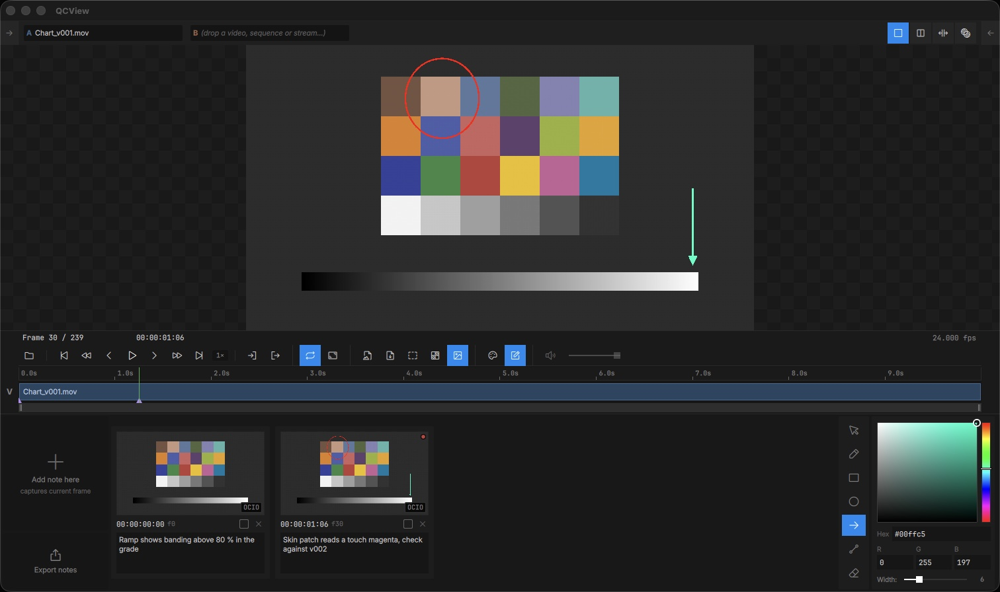

# Annotations

The Notes panel manages text notes and drawn annotations for loaded media. Annotations are saved in a `.qcview` folder alongside the media file, so they're accessible to anyone with file-system access and load automatically with the media.

Open the Notes panel with `Ctrl + 4`.

---

## Creating Notes

Click **Add Note** to create a note at the current playhead position. A diamond marker appears on the timeline. Type in the text field.

### Drawing Tools

The annotation toolbar on the right of the Notes panel provides a pointer (select, move, scale or delete a drawn shape), freehand pen, box, circle, arrow, line and eraser, plus a color picker and a line-width slider for drawing directly on the viewport. The note's thumbnail picks up the strokes.

| Shortcut | Action |
|---|---|
| `Ctrl + Z` | Undo stroke |
| `Ctrl + Shift + Z` | Redo stroke |
| `Esc` | Cancel the stroke in progress |

Note thumbnails are captured through the active OCIO chain and marked **OCIO**; hover the mark to see the chain.

> If the Notes panel is open, screenshots are captured with embedded annotations.

---

## Exporting Notes

Export annotations from the Notes panel's Export menu:

| Format | Details |
|---|---|
| Markdown | Creates a folder with the note text + exported images |
| HTML | Single file with embedded images |
| PDF | Single file with embedded images |
| DOCX | Single file with embedded images--combatible with Google docs |

PDFs and DOCX exports will split the content into pages.
