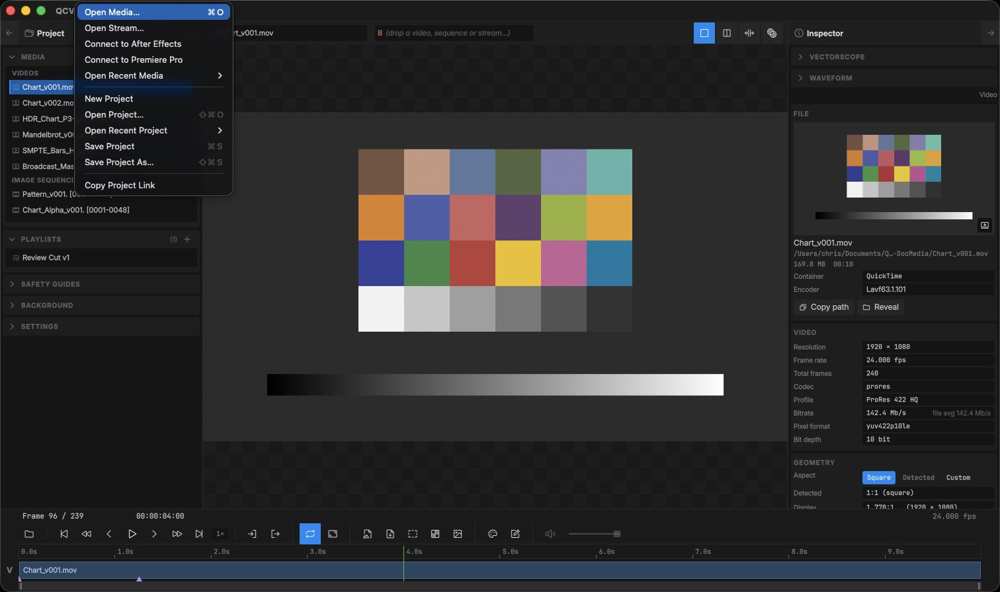
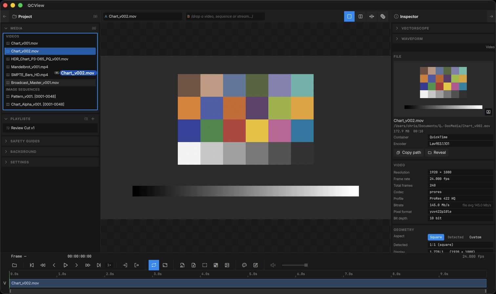
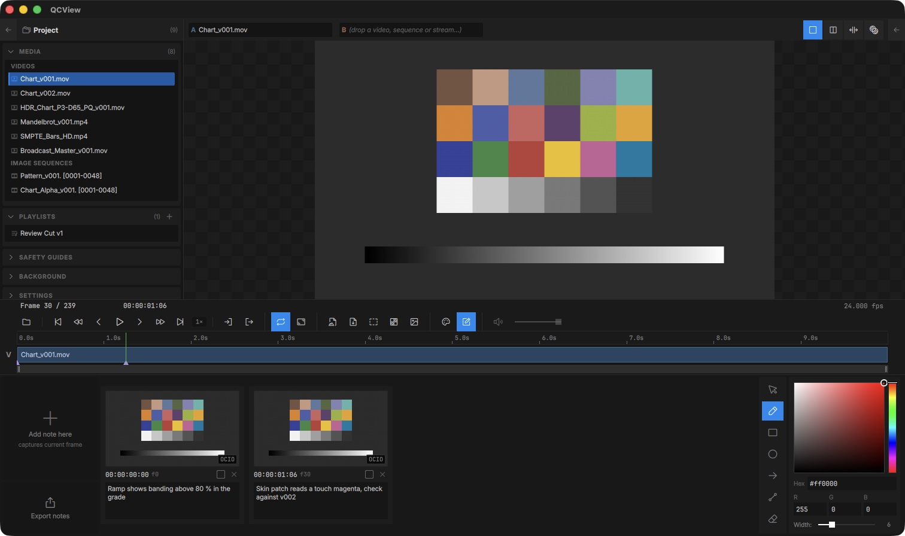
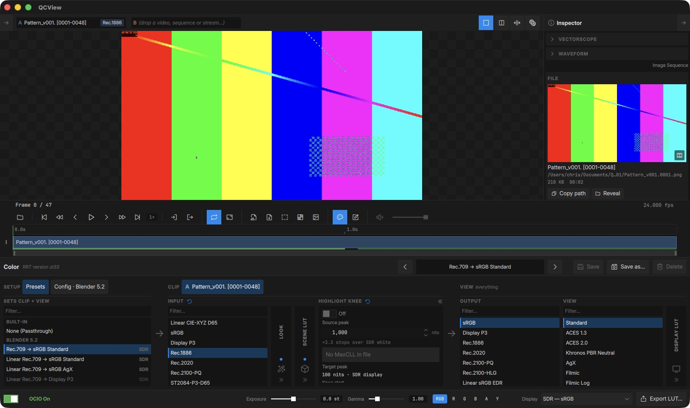
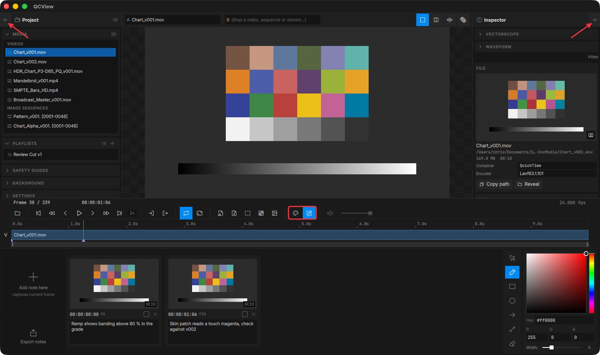
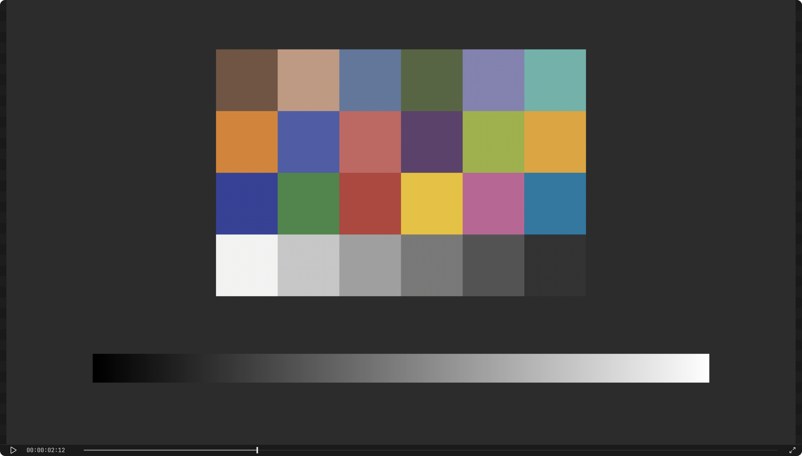
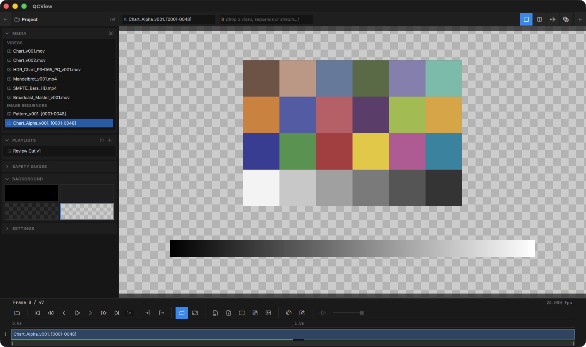
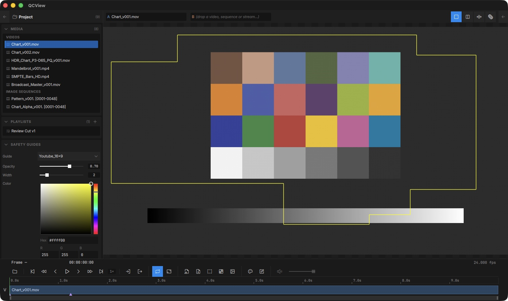
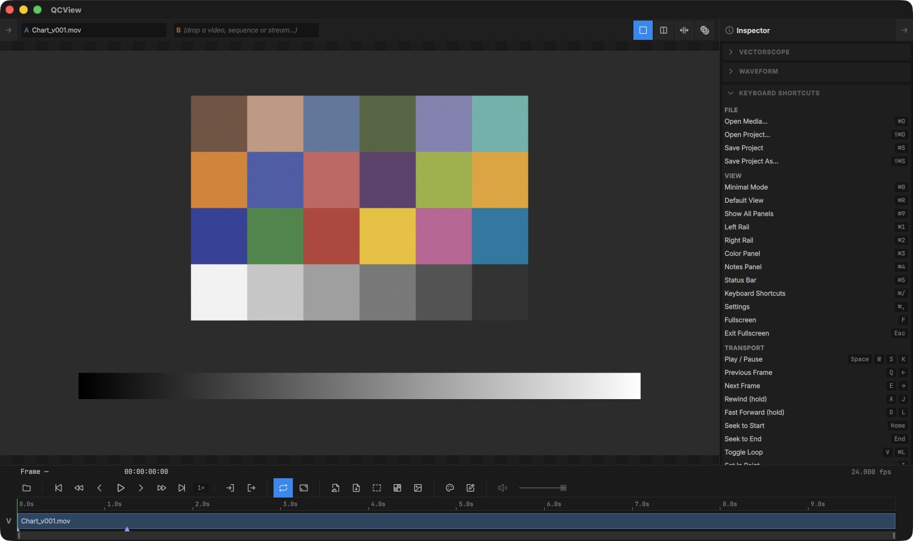
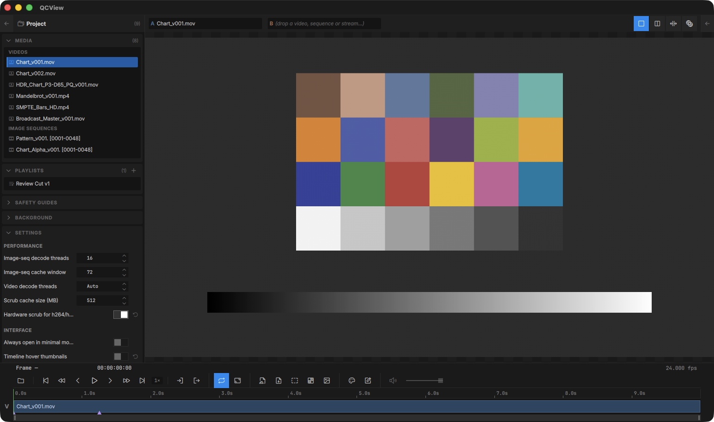

# App Basics

## Opening Files

### File Menu

Use the **File** menu to load media into QCView:

| Action | Shortcut |
|---|---|
| Open Media | `Ctrl + O` |
| Open Stream | Opens a live stream by URL (e.g. `srt://…`) |
| Connect to After Effects / Premiere Pro | Receive a live source from the [QCViewBridgeAE](/qcbridge/adobe/) add-on |
| Open Project | `Ctrl + Shift + O` |
| Save Project | `Ctrl + S` |
| Save Project As | `Ctrl + Shift + S` |
| New Project | Clears the current project |
| Copy Project Link | Copies a `qcview://` link to the saved project (see [Project Links](/project-manager/#project-links)) |

Recent media and recent projects are also reachable from the **Open Recent** submenus.

### Drag and Drop

You can drag files directly into the app. Drag one or more files to the viewport to load them immediately, or onto the Project panel's media list to add them to the project; the list outlines in blue while you're over it.

To load files already in your project, double-click them in the media panel or drag them into the viewport.

---

## Layout

### Panels

Toggle panels from the **View** menu or with keyboard shortcuts:

| Panel | Shortcut |
|---|---|
| Left Rail (Project, Settings, Background, Safety) | `Ctrl + 1` |
| Right Rail (Scopes, Inspector, Shortcuts) | `Ctrl + 2` |
| Color Panel | `Ctrl + 3` |
| Notes | `Ctrl + 4` |
| Status Bar | `Ctrl + 5` |

You can also use the mouse to toggle panels. Rails can be opened and closed by clicking the caret buttons in their headers. The color and notes panels can be opened via buttons on the transport row.

### Layout Presets

| Preset | Shortcut | Description |
|---|---|---|
| Minimal Mode | `Ctrl + 0` | Viewport + transport only; the rails collapse to their slim strips |
| Compact Mode | `Ctrl + Shift + C` | Viewport plus one slim strip: play / pause, timecode, a scrub line and exit. Press `Ctrl + Shift + C` again, `Esc`, or the strip's ✕ to leave; your panels come back as they were |
| Show All Panels | `Ctrl + 9` | Opens every panel |
| Default View | `Ctrl + R` | Rails, timeline, Color panel and status bar |
| Fullscreen | `F` | Viewport only, no UI. Press `F` or `Esc` to exit |

Compact Mode is for a window that is nothing but the picture: every panel, rail and toolbar goes away, the window loses its title bar, and a 22 px strip under the viewport keeps a play / pause button, the timecode, a scrub line with the playhead and in / out marks, and an exit button; `F` still toggles fullscreen. Drag the timecode to move the window; the window's edges still resize it. Scrubbing on the strip works the way the timeline does, in single, dual and playlist view. Live sources show a live dot instead of the playhead. On macOS the menu bar stays at the top of the screen; on Windows the menu is hidden with the rest of the chrome, so use the shortcuts (`Alt + F4` still closes the app).

## Backgrounds and Overlays

### Backgrounds

QCView provides background options for reviewing alpha-channel media: grey, black, light checkerboard, dark checkerboard. Alpha channels in any media pass through to the selected background. Open the Background section from the Left Rail (Tools menu → Background, or `Ctrl + 1` then expand).

### Title Safety Guides

Open the **Safety Guides** section in the Left Rail (Tools menu → Safety Guides) to overlay broadcast and social-media safety guides on the viewport.

---

## Keyboard Shortcuts

The full keyboard shortcut reference lives at the bottom of the Right Rail under **Keyboard Shortcuts** (`Ctrl + /`).

## Settings

The Settings panel opens in the Left Rail (`Ctrl + ,` or Tools menu → Settings…).

