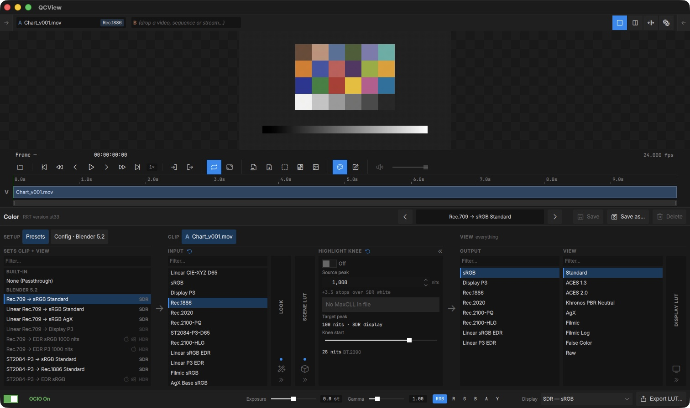
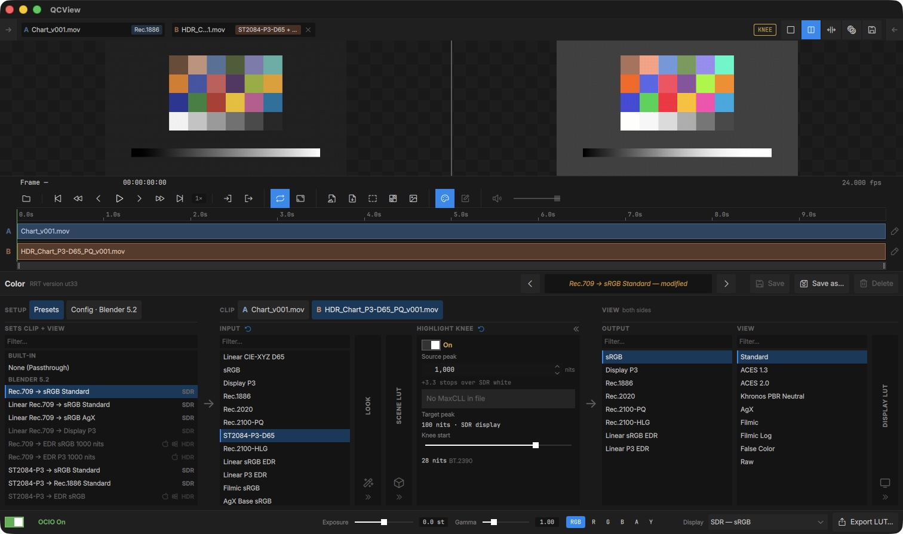

# OCIO Color

QCView includes a live [OpenColorIO](https://opencolorio.org/) pipeline. Build transform chains in the **Color** panel (`Ctrl + 3`) and see results applied to the viewport in real time.

**Bundled configs:** ACES 2.0, ACES 1.3, Blender 5.2, Blender 5.1

Both ACES 2.0 and the Blender configs are appended with **Linear sRGB EDR** and **Linear P3 EDR** display outputs for macOS Extended Dynamic Range workflows.

Use the `OCIO On / Off` switch at the bottom to toggle color correction.

---

## Layout

The Color panel reads left to right in three groups, the same way in single and dual view:

| Group | Columns | Applies to |
|---|---|---|
| **Setup** | Presets, Config | Picks the names every other column uses |
| **Clip** | Input, Look, Scene LUT, Highlight Knee | The selected clip only |
| **View** | Output, View, Display LUT | Everything on screen |

Each column is a list you scroll and filter to pick a value. The narrow columns (Look, Scene LUT, Display LUT, Highlight Knee) collapse to a strip when they are not in use; click one to open it.

### Setup

- **Presets** — recall a saved chain. A preset sets both halves of the panel: its clip half on the selected clip, its view half on the View. Presets that don't suit the current display mode are dimmed, and each one is tagged **SDR** or **HDR**.
- **Config** — pick the OCIO config (ACES 2.0 / ACES 1.3 / Blender 5.2 / Blender 5.1).

### Clip

The Clip group is the selected clip's own chain, so each clip can be read differently: an sRGB render next to a PQ master, for example.

- **Input** — the clip's source colorspace
- **Look** — optional creative look (Blender's AgX, Contrast, Punchy, etc.)
- **Scene LUT** — optional LUT applied in the scene-linear stage: a `.cube` file, or an ASC CDL (`.cc`, `.ccc`, `.cdl`). For a CDL collection, a **Correction ID** field picks the correction (an id or an index; empty uses the first).
- **Highlight Knee** — see [below](#highlight-knee)

Every change you make here stays with that clip. A column the clip has set shows **↺** in its header; click it to go back to the default. Clips that haven't set a column follow the default chain, which is what you edit when no clip is loaded.

Clip chains are saved with the project. A clip with its own chain shows a badge — its Input, plus anything else it sets — on its row in the [Project panel](/project-manager/) and on its A / B chip above the viewport.

### View

The View group is shared by everything on screen, both sides of a dual view included:

- **Output** — the display colorspace
- **View** — the display view (e.g. an HDR view for an EDR output)
- **Display LUT** — optional `.cube` LUT applied at the display stage

---

## Dual view

In dual view the Clip group has an **A** and a **B** tab, named after each side's clip. The tab you pick is the clip you are editing, and each side renders through its own chain; the View group still applies to both.

Here A is an SDR render read as Rec.1886, and B is a PQ master in P3-D65 read as `ST2084-P3-D65` with the Highlight Knee on. Each chip shows its clip's badge.

To give many clips the same Input at once, use the Project panel's right-click menu (see [Project Panel](/project-manager/#clip-colour)).

---

## Highlight Knee

An optional step between the scene side and the View that compresses highlights above a chosen level into the display's range, for checking HDR material on a display that can't show it all.

- **Source peak** — the brightest level in the source (nits). **Use file MaxCLL** takes it from the file's HDR metadata when present.
- **Target peak** — the display's peak (100 nits on an SDR display).
- **Knee start** — where the compression begins; defaults to the BT.2390 knee. Double-click the slider to reset it.

While the knee is compressing, an amber **KNEE** pill sits in the viewport bar as a reminder that the picture is not 1:1. The knee is part of the clip's chain and is saved in presets.

---

## Viewer aids

The bottom bar holds inspection aids for looking into the source. They need OCIO on, are captured in screenshots and note thumbnails, and are never saved in presets or baked into exports.

| Control | What it does |
|---|---|
| **Exposure** | Linear gain before the View, in stops (±4) |
| **Gamma** | Lifts (> 1) or lowers (< 1) the result, 0.25–4 |
| **RGB / R / G / B / A / Y** | Show all channels, one channel, alpha, or luma |

---

## Presets

Configure a chain you like, then click **Save as…** to capture it as a named preset. **Save** updates the current preset, **Delete** removes it, and the arrows on either side of the preset name step through the list. When you change a preset's settings its name shows **modified**.

## Export LUT

The **Export LUT** action serializes the current chain to a `.cube` file for use in other software.
