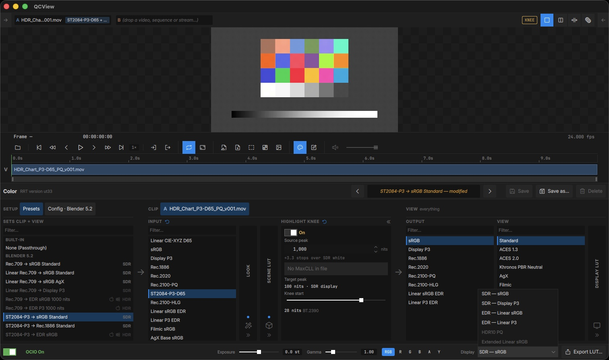

# SDR vs HDR

The **Display** list at the bottom right of the Color panel switches between the SDR and HDR modes your system offers. Modes the current display can't show are greyed out.

For the most part, you will want `SDR — sRGB` on both macOS and Windows, `HDR10 PQ` for HDR on Windows, and `EDR — Linear P3` for HDR on macOS.

The presets list reacts to the mode you are in: presets that don't suit it are dimmed, and each preset is tagged **SDR** or **HDR**.

---

## Color output with OCIO

### SDR mode

In SDR mode, use an `sRGB` or a `Rec.1886` output for a standard display-referred result.

To check an HDR master on an SDR display, turn on the clip's [Highlight Knee](/color/#highlight-knee): it compresses the highlights above your chosen source peak into the display's range instead of clipping them, and shows an amber **KNEE** pill while it does.

---

### HDR mode (Windows)

With Windows `HDR10 PQ` mode enabled, use `Rec.2100-PQ` or a similarly named PQ output.

---

### HDR mode (macOS — EDR)

In `EDR — Linear P3` mode, use the matching `Linear P3 EDR` output in the ACES 2.0 or Blender 5.2 configs (`Linear sRGB EDR` for `EDR — Linear sRGB`).

---

## HDR sources

Pick the source's colorspace as the clip's **Input**: `Rec.2100-PQ` for a BT.2020 PQ master, `ST2084-P3-D65` for a PQ master graded in P3-D65 (Resolve's "P3-D65 ST2084"), `Rec.2100-HLG` for HLG. The Input stays with that clip, so SDR and HDR clips can sit side by side in the same project or dual view.

The Inspector's **HDR metadata** row shows the file's MaxCLL, MaxFALL and mastering peak when the container carries them.

---

## HDR sources without tags

Some HDR exports carry no transfer tag, and a live source never carries a file's tags: an SRT stream brings what its encoder put in the bitstream, and a QCBridge Transmit feed is the host's working space, untagged by nature. QCView treats an untagged source as SDR, so the scopes would measure it in percent.

- **Files, stills and sequences** — set the **Transfer** pill in the Inspector (Color card for video, Image Sequence card for sequences and stills): `PQ 2020`, `PQ P3`, `HLG`, or `Linear` for a scene-linear feed. Auto tells you what the tags resolve to before you override them.
- **Streams** — the same choice is a chip on the live strip, next to the Color panel button.
- **With OCIO on**, the clip's Input still decides how the picture and the scopes read the source; the Transfer pill then feeds the scope's mismatch note when the two disagree.

---

## Measuring in nits

The waveform's nits scale is linear luminance: PQ and HLG sources plot their absolute values, and an SDR or scene-linear source puts its white at 100 nits, what a reference SDR monitor shows. The amber **203** line marks HDR graphics white (BT.2408) for placing titles and SDR inserts in an HDR programme. The **Auto · % · nits** chips under the waveform force either scale; see [Scopes](/inspector/#scopes).
