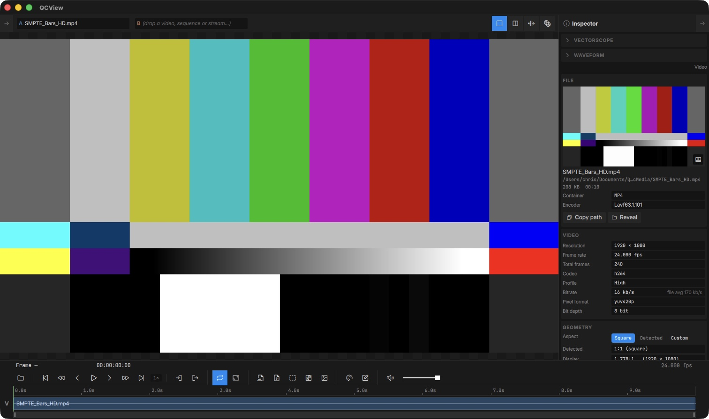
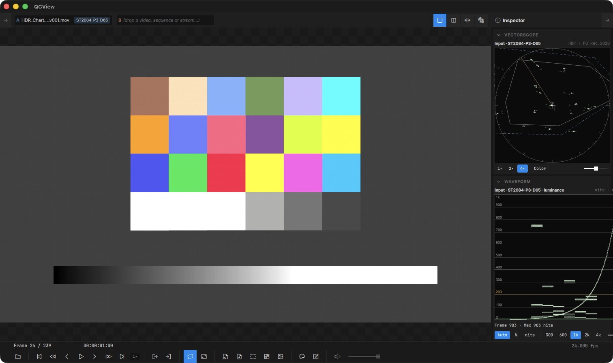
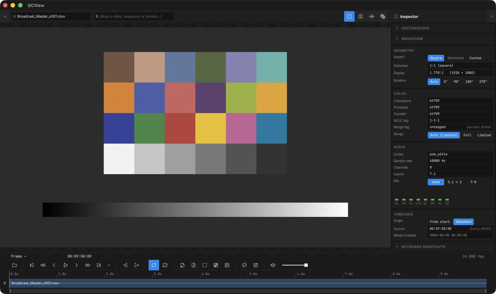
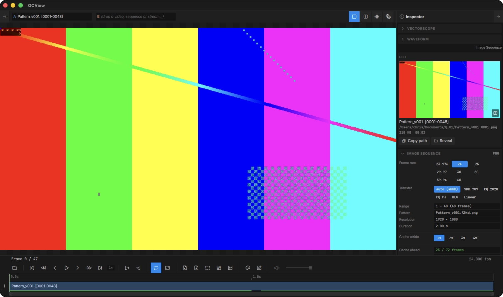

# Inspector

The Inspector lives in the Right Rail (`Ctrl + 2`). It shows per-source properties and provides quick paths to the source files.

## Scopes

The **Vectorscope** and **Waveform** sections sit at the top of the Inspector. Expand one to turn it on; collapsed scopes cost nothing. The scopes read the source itself, before your View, and the label above each one says how it is being interpreted:

- **Input** — OCIO is on: the scope follows the clip's Input from the [Color panel](/color/).
- **Assumed** — OCIO is off: the colorspace is taken from the file's tags, or from the **Transfer** pill when you have set one (the targets are dimmed).
- **Signal** — nothing to go on: the raw signal.

**Vectorscope** — colour-bar targets, Rec.709 / P3 / Rec.2020 gamut outlines and the skin-tone line. The `1× 2× 4×` buttons zoom, **Color** tints the trace by hue, and the slider sets the trace brightness.

**Waveform** — the signal's level by image column, on one of two scales:

- **Percent** (SDR): the signal's own Y′ from 0–100 %, with room above and below so super-whites and sub-blacks show.
- **Nits** (HDR): linear luminance, with lines at 300, 600, 1000, 2000 and 4000 nits (pick the top of the scale with the `300 … 4k` chips) and an amber line at **203**, HDR graphics white (BT.2408). PQ and HLG sources plot their absolute luminance. An SDR or scene-linear source on this scale puts its white at **100 nits**, what a reference SDR monitor shows, so an SDR clip beside a PQ master in dual view reads where a monitor would put it.

Under the trace, **Frame · Max** gives the brightest level in the current frame and the highest seen since the clip started; hover it for the brightest channel, and click **Reset** to start over.

**Choosing the scale** — the **Auto · % · nits** chips. **Auto** follows the interpretation above: SDR sources on percent, everything else on nits. **%** and **nits** force one or the other; the scale label says *(manual)* while a forced scale disagrees with Auto. Forcing nits needs something to convert from, so a Signal-tier source stays on percent. The choice is shared with the vectorscope and remembered between launches.

**Sources without usable tags** — an HDR export whose file carries no transfer tag reads as SDR and lands on the percent scale. Tell the scopes what it is with the **Transfer** pill (see [Per-clip properties](#per-clip-properties-pills)); streams have the same control on the live strip.

In dual view each side is read from its own file, drawn in its own colour.

## Path actions

The Inspector shows the file path of the currently-loaded media with two path actions:

| Button | Action |
|---|---|
| Copy path | Copies the path to the clipboard (native separators on each OS) |
| Reveal in Explorer / Finder | Opens the containing folder and selects the file |

## File and video details

The **File** card names the container family (QuickTime, MP4, MXF, Matroska…) and, for MXF, the operational pattern — **OP1a** (interleaved, what Adobe Media Encoder / Premiere / Resolve write) versus **OP-Atom** (Avid's one-essence-per-file layout) — plus the authoring tool when the file records one (MXF identification set, QuickTime `©swr`, Matroska writing app).

The **Video** card shows the codec and its flavor in export-menu terms: ProRes 422 / HQ / 4444, and for Avid VC-3 the Compression ID is read from the first frame so you get the actual bandwidth name — **DNxHD 36 / 115 / 145 / 175 / 220…**, the **x** suffix marking the 10-bit variants (175x, 220x), **DNxHD 444**, and the resolution-independent **DNxHR LB / SQ / HQ / HQX / 444** classes. A **Bitrate** row lists the video stream's rate when the container declares it (or DNxHD's fixed nominal), with the whole-file average alongside.

Projects saved before these fields existed are back-filled on open with a header-only re-probe — no full re-scan, and offline volumes are simply retried next launch.

## Per-clip properties (pills)

Several properties are stored per media item and shown as togglable **pills** in the Inspector:

- **Transfer override** — tell the scopes how to read a source whose tags are missing or wrong: **Auto** follows the file's tags (the pill says what Auto resolves to, e.g. "Auto (SDR, untagged)"), or pick **SDR 709**, **PQ 2020**, **PQ P3**, **HLG** or **Linear**. Untagged sources read as SDR, so an HDR export without tags needs this to measure in nits. With OCIO on, the clip's Input still drives the picture and the scopes; the pill then only feeds the scope's mismatch note. Streams get the same control on the live strip, since a stream is never probed: an SRT feed's tags arrive with the session, and a QCBridge feed carries none by nature. Image sequences and stills have the same pill on the Image Sequence card, where Auto means scene-linear for EXR and sRGB for everything else.
- **Video range override** — force the decoder to interpret the source as limited or full range, overriding container metadata. Useful for sources that are mis-tagged. **Auto** follows the container tag; when the file carries no tag, Auto falls back to the convention for the pixel class and says so on the pill — YCbCr sources assume **limited** (what every player assumes), RGB sources (uncompressed RGB, Animation, PNG/TIFF-in-MOV…) assume **full** and are shown exactly as stored — with one codec-level exception: untagged Avid DNx 4:4:4 (RGB included) is read as **limited**, the Avid codec's own convention and how Avid / After Effects interpret it. Pick **Limited** on any other RGB source to expand video-level RGB (16–235) to full. The Color card's **Range tag** row shows the container's tag (or "untagged") and, when the container is silent, where the effective range came from (e.g. "decoder: limited").
- **Timecode Origin** — pick which embedded timecode track drives the playhead readout (DV, TimeCode, MXF), or **From start** to ignore embedded timecode and count from frame 0.
- **Broadcast Master Audio Mix** — pick which mix you want to preview. If QCView detects a broadcaster master with 6 or 8 tracks, it will perform a technical mix of the tracks for preview. If stereo tracks are on tracks 7 and 8, they will be automatically selected. Click on the 5.1 toggle to preview the 5.1 downmixed to stereo.

Pill states persist with the project on save and re-apply on open.

## Adobe Projects

The **Adobe Projects** section scans the file's metadata via ExifTool for linked source projects. If QCView finds After Effects or Premiere project references, it displays them with an **Open** button to jump to the source project.

## Image Sequences

For image sequences, the Inspector displays resolution, frame count, format, and per-format details (EXR compression and channel layout, etc.). You can select which layer set to view, adjust framerate, and select a skip-frame stride for heavy sequences that won't playback without help.

