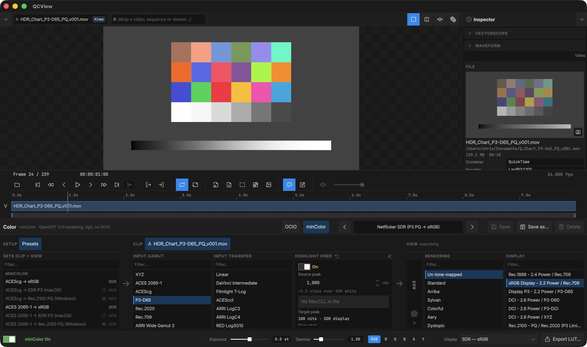
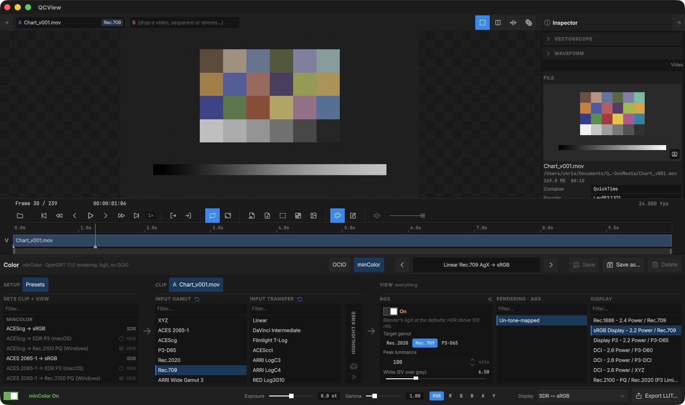

# minColor

The Color panel has a second engine beside OCIO. **minColor** is the core of the [minColorAE](https://github.com/cbkow/minColorAE) plug-in built into QCView: a fixed chain with no config file, which reads the source in a named gamut and transfer, optionally shapes it with the Highlight Knee and AgX, renders it un-tone-mapped or through an OpenDRT look, and encodes it for the display.

Pick the engine with the **OCIO | minColor** segment in the preset bar. The one **On / Off** switch at the bottom covers whichever engine is selected, so off is off. QCView remembers the engine you last used; a fresh install starts on OCIO.

---

## The chain

The panel keeps its three groups. Under minColor the columns inside them are:

| Group | Columns | Applies to |
|---|---|---|
| **Setup** | Presets | minColor's own preset list |
| **Clip** | Input gamut, Input transfer, Highlight Knee | The selected clip only |
| **View** | AgX, Rendering, Display | Everything on screen |

Scene values travel in linear Rec.2020 between the columns. Every change is a parameter, not a shader, so sliders respond at frame rate on both platforms.

### Input

- **Input gamut** — the source primaries: XYZ, ACES 2065-1, ACEScg, P3-D65, Rec.2020, Rec.709, and the camera gamuts (ARRI Wide Gamut 3 / 4, RED Wide Gamut, Sony S-Gamut3 / S-Gamut3.Cine, Panasonic V-Gamut, Filmlight E-Gamut / E-Gamut2, DaVinci Wide Gamut).
- **Input transfer** — how the file's code values decode: Linear, the camera logs (DaVinci Intermediate, Filmlight T-Log, ACEScct, ARRI LogC3 / LogC4, RED Log3G10, Panasonic V-Log, Sony S-Log3, Fuji F-Log2), the display decodes (Rec.1886, sRGB, 2.2 power, BT.709 camera), and the HDR ones (PQ with 100 nits at 1.0, HLG at 1000 nits).

Both stay with the clip, like the OCIO Input: a column the clip has set shows **↺** in its header, and clips with their own settings carry a badge in the Project panel and on the A / B chips. The pins are saved with the project.

### Highlight Knee

The same knee as the OCIO chain, between the Input and the View: it compresses highlights above the source peak into the display's range. See [Highlight Knee](/color/#highlight-knee) for the controls. It is per clip and off by default in every built-in preset.

### AgX

An optional picture formation before the rendering: a parametric, HDR-capable AgX that matches Blender's at its defaults. While it is on the Rendering reel offers only Un-tone-mapped, since AgX has already formed the picture.

| Control | What it does |
|---|---|
| **Target gamut** | The gamut the picture is kept inside: Rec.2020 (no rail), Rec.709 or P3-D65 |
| **Peak luminance** | 100 nits is SDR; above it the curve opens up for an HDR display |
| **White / Black (EV)** | Stops over and under grey that reach the top and the floor (6.5 / −10) |
| **Contrast, Toe power, Shoulder power** | The sigmoid's slope at the pivot and the shape of its ends |
| **Hue restore** | How much of the pre-curve hue is kept (0.6, as Blender) |
| **HDR purity** | Hue and saturation restored around the grey darkening on HDR peaks |

### Rendering

- **Un-tone-mapped** — the scene values go straight to the display encoding. Every built-in preset uses this.
- **An OpenDRT look** — Standard, Arriba, Sylvan, Colorful, Aery, Dystopic, Umbra or Base: the OpenDRT 1.1.0 picture formation with that look's tonescale and creative white. A look is only ever an explicit choice.

### Display

The display encoding: Rec.1886 / Rec.709, sRGB 2.2 / Rec.709, Display P3, the DCI P3 and XYZ encodings, Rec.2100 PQ and HLG (P3-limited), Dolby PQ / P3-D65, and the linear hand-offs (working gamut, ACES 2065-1, ACEScg, Rec.2020, Rec.709 and P3-D65). The hand-offs are for the EDR modes on macOS, where the system expects linear light with 1.0 at SDR white; the PQ entries are for HDR10 on Windows. Pick the one that matches the current [display mode](/hdr/); the preset list is tagged **SDR** / **HDR** and dims the presets that don't suit it.

---

## Presets

minColor has its own preset list, separate from OCIO's, with the same Save / Save as… / Delete and the arrows. The built-ins cover the working spaces a review meets, each to the sRGB display for SDR, to **EDR P3** for macOS HDR and to **Rec.2100 PQ** for Windows HDR:

| Input | SDR | macOS | Windows |
|---|---|---|---|
| ACEScg | ACEScg → sRGB | → EDR P3 | → Rec.2100 PQ |
| ACES 2065-1 | ACES 2065-1 → sRGB | → EDR P3 | → Rec.2100 PQ |
| Linear Rec.709 | → sRGB, and an **AgX** variant | → EDR P3 | → Rec.2100 PQ |
| Linear Rec.2020 | → sRGB, and an **AgX** variant | → EDR P3 | → Rec.2100 PQ |
| P3-D65 PQ | **Netflicker SDR** (P3 PQ → sRGB) | → EDR P3 | → Rec.2100 PQ |

**Netflicker SDR** reads a P3-D65 PQ master for an SDR review; turn the Highlight Knee on (1000 → 100 nits is the usual setting) to see what sits above the display's range. The PQ presets carry a 1000-nit peak for an OpenDRT look.

---

## Everything else works the same

Screenshots and note thumbnails are taken through the sRGB equivalent of the chain, so an EDR or PQ view still saves a correct SDR file. **Export LUT…** bakes the active minColor chain to a `.cube`. The [scopes](/inspector/#scopes) read the source through the clip's Input, with an `Input · minColor` badge naming the transfer. The viewer aids (Exposure, Gamma, channel view) apply after the chain as they do under OCIO.

Switching engines never loses anything: each engine keeps its chain, pins and preset selection, and switching back lands where you left it.

---

## Credits

minColor is GPL-3.0, like QCView. Its rendering is derived from [OpenDRT](https://github.com/jedypod/open-display-transform) v1.1.0 by Jed Smith, modified; minColor AgX ports parts of [darktable](https://github.com/darktable-org/darktable)'s AgX module by István Kovács and the darktable developers, and follows the primaries and HDR method of Blender's AgX by Zijun Eary Zhou (Eary Chow), Mark Faderbauer and Sakari Kapanen; AgX is by Troy Sobotka. QCView is not affiliated with or endorsed by any of them. The full notices ship with the app in `LICENSES/minColor-NOTICE.txt`.
