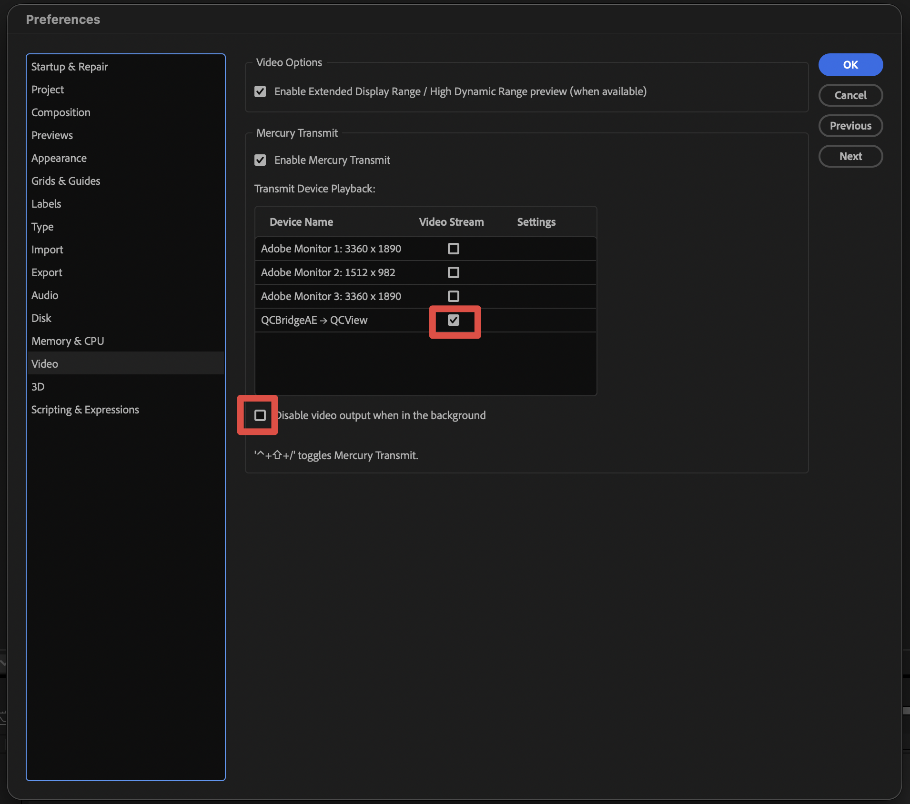
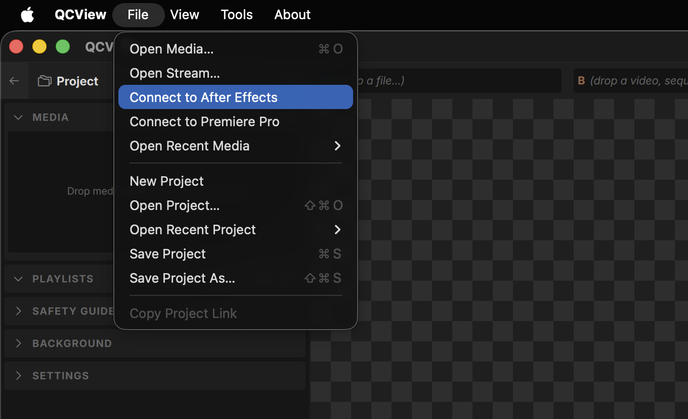
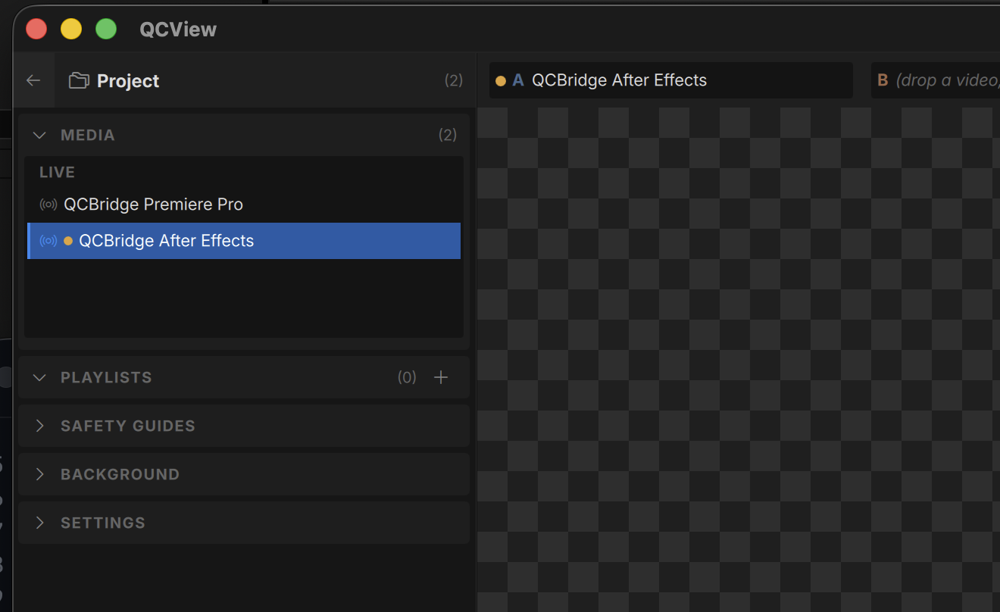

# QCBridgeAE for After Effects and Premiere Pro

[QCBridgeAE](https://github.com/cbkow/QCBridgeAE) is a **Mercury Transmit** plugin that streams live viewport output from the the AE or Premiere to QCView. The output is unaltered and full float, converted to 1/2 float in QCView so the image quality is preserved under all circumstances, including HDR scenarios.

---

## Requirements

- **QCView 2.4.0 or newer** on the same machine.
- After Effects or Premiere Pro with Mercury Transmit (any current release).
- macOS on Apple Silicon, or Windows x64.

---

## Installation

Quit After Effects and Premiere Pro first. Download the installer from the [QCBridgeAE releases](https://github.com/cbkow/QCBridgeAE/releases):

- macOS: `QCBridgeAE-<version>-arm64.pkg` 
- Windows: `QCBridgeAE-<version>-Setup-x64.exe` 

Updating is the same step with a newer installer.

---

## Setup

**In After Effects:** *Settings → Video Preview*

1. Tick **Enable Mercury Transmit**, then tick **QCBridgeAE → QCView**.
2. **Untick "Disable video output when in the background"**. With it ticked (the default), After Effects stops sending the moment you click into QCView — QCView shows *PAUSED* and names this setting.

**In Premiere Pro:** *Settings → Playback* — the same two ticks, and the same background setting to untick.

**In QCView:** *File → Connect to After Effects* (or *Connect to Premiere Pro*). The source appears in the **Live** bin as **QCBridge After Effects** / **QCBridge Premiere Pro** and waits until the host is sending.

**Set QCView's OCIO input to your project's working space.** The pixels arrive in the host's working colour space, untransformed. With Adobe colour management that is the project's working space; with OCIO colour management, the OCIO working space (for example ACEScg).

---

## What to expect

- Frames are RGBA16F. The host sends 32-bit float; values above 1.0 and negatives are kept, and nothing is clamped. 
- After Effects flattens transparency over the **comp background colour**, so its frames are opaque. Premiere Pro carries **straight alpha**.
- Mercury Transmit is always a few frames behind AE (Just how it works and shares the same issue with Blackmagic, Aja, or other plugins), but Premiere is fairly tightly synced — depending on system resources and timeline resolution.
- You can stream from AE and Premiere at the same time and between them, or use them in QCView Dual View review modes.

